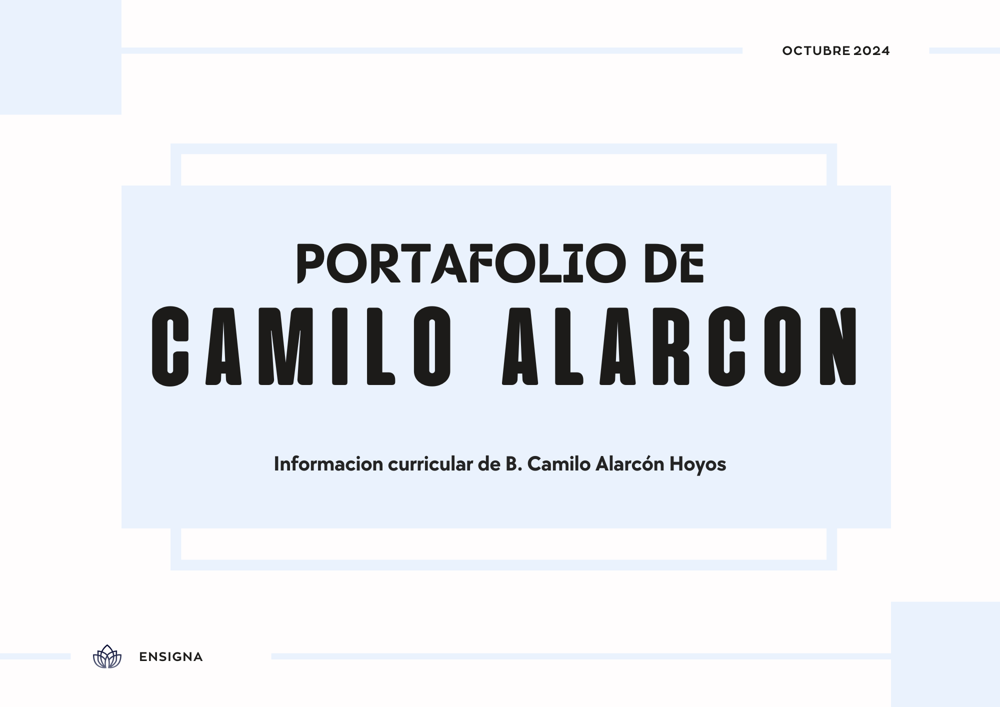
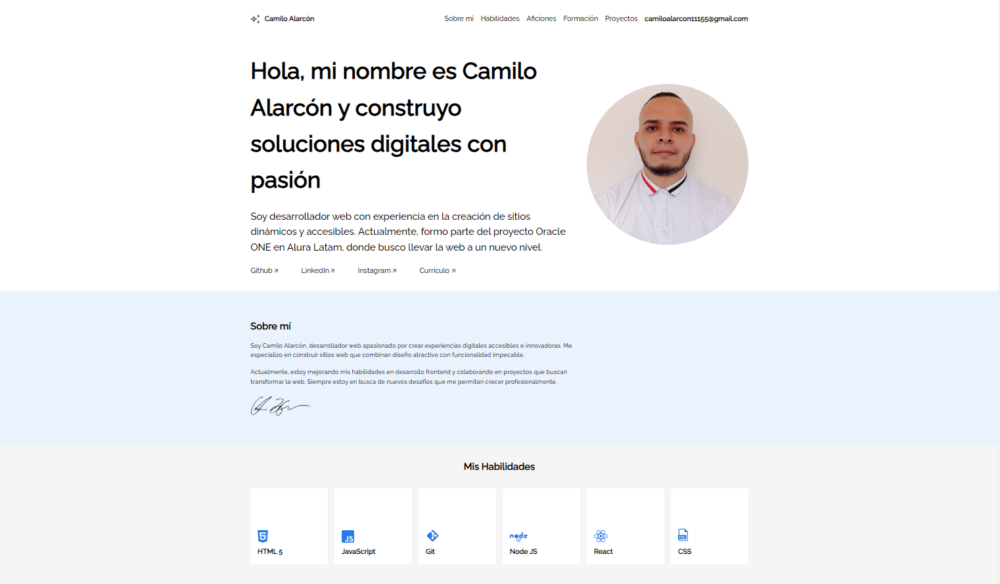
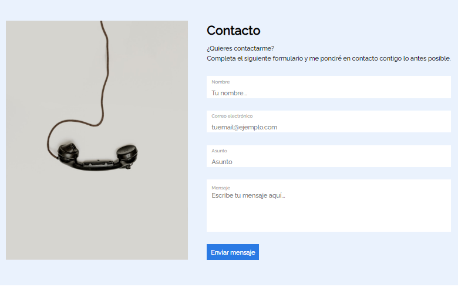
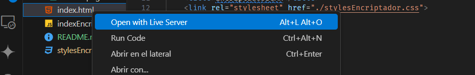

## Título del proyecto 

<h1 align="center">Portafolio de Camilo Alarcón</h1>


## Imagen de portada




## Insignias

       


## Índice

- [Título del proyecto](#título-del-proyecto)
- [Imagen de portada](#imagen-de-portada)
- [Insignias](#insignias)
- [Índice](#índice)
- [Descripción del proyecto](#descripción-del-proyecto)
- [Estado del proyecto](#estado-del-proyecto)
- [Características de la aplicación y demostración](#características-de-la-aplicación-y-demostración)
- [📁 Acceso al proyecto](#-acceso-al-proyecto)
- [🛠️ Abre y Ejecuta el Proyecto](#️-abre-y-ejecuta-el-proyecto)
- [Tecnologías utilizadas](#tecnologías-utilizadas)
- [Autores](#autores)
- [Licencia](#licencia)


## Descripción del proyecto 

**Portafolio BCAH** es una presentación visualmente atractiva y funcional diseñada para mostrar mi trayectoria profesional y habilidades. Este proyecto está desarrollado con HTML, CSS y JavaScript, y está orientado a quienes buscan una forma clara y efectiva de presentar su información curricular. A través de un diseño intuitivo, los visitantes pueden explorar mis proyectos, experiencia laboral y habilidades, brindando una visión completa de mi perfil profesional.


## Estado del proyecto

Esta sección muestra el estado actual del proyecto mediante insignias informativas.

- **Fecha de Lanzamiento**:   
- **Estado del Proyecto**:   
- **Fecha Última Actualización**: 


## Características de la aplicación y demostración

- **Funcionalidad 1**: Presentación de Proyectos  
  Muestra una lista de proyectos destacados con descripciones breves y enlaces a sus respectivas páginas.

- **Funcionalidad 2**: Sección de Experiencia Laboral  
  Permite visualizar la experiencia laboral con detalles sobre roles anteriores, empresas y logros.

- **Funcionalidad 3**: Diseño Responsivo  
  Optimiza la visualización del portafolio en diferentes dispositivos, garantizando una experiencia de usuario fluida.

- **Funcionalidad 4**: Formulario de Contacto  
  Permite al usuario contactar al dueño del portafolio llenando un formulario, facilitando la comunicación para consultas o propuestas.





## 📁 Acceso al proyecto

- **Acceso al Proyecto en Línea**: Puedes ver y usar el proyecto en línea a través del siguiente enlace: [myPortafolio](https://camiloalarcon1155.github.io/myPortafolio/).

- **Código Fuente del Proyecto**: El código fuente está disponible en GitHub. Puedes acceder al repositorio del proyecto aquí: [Repositorio en GitHub](https://github.com/camiloalarcon1155/myPortafolio). 

  El repositorio consta de seis ramas que muestran el avance del proyecto:
  - **layout-basico**: Contiene la estructura básica del diseño.
  - **layout-basico-movil**: Presenta los avances realizados para lograr un layout básico optimizado para dispositivos móviles.
  - **layout-basico-tablet**: Muestra la adaptación del diseño para tabletas.
  - **layout-basico-desktop**: Incluye el diseño para computadoras de escritorio.
  - **layout-basico-desktop-grande**: Presenta un diseño optimizado para pantallas grandes.
  - **final-layout-personalizado**: Contiene el contenido completo del desafío, incluyendo el archivo `README.md` y el archivo `.gitignore`.


## 🛠️ Abre y Ejecuta el Proyecto

Para abrir y ejecutar el portafolio localmente, sigue estos pasos:

1. **Clona el Repositorio**: Usa Git para clonar el repositorio a tu máquina local con el siguiente comando:
   ```bash
   git clone https://github.com/camiloalarcon1155/myPortafolio.git

2. **Navega al Directorio del Proyecto**: Una vez clonado, accede al directorio del proyecto:
   ```bash
   cd myPortafolio

3. **Abre el Proyecto**: Abre el archivo index.html en tu navegador web preferido. Puedes hacerlo directamente arrastrando el archivo al navegador o usando la opción de abrir archivo en el navegador. puedes usar el siguiente codigo git para abrir una carpeta completa con tu proyecto: 
   ```bash
   code ./ -r

5. **Ejecuta el Proyecto**: No es necesario ningún servidor o configuración adicional para ejecutar este proyecto. Solo necesitas un navegador web para ver y utilizar la aplicación. Puedes usar el live server de visual studio Code para conectar con tu navegador: 
   
   


## Tecnologías utilizadas

   - JavaScript
   - HTML
   - CSS
   - GitHub


## Autores

| [<br><sub>Camilo Alarcón Hoyos</sub>](https://github.com/camiloalarcon1155) | [<br><sub>aluraLATAM</sub>](https://www.aluracursos.com/) |
| :---: | :---: |


## Licencia

Este proyecto es parte de un challenge de [Alura Latam](https://www.aluracursos.com/). 

- **Licencia**: El proyecto se distribuye bajo la [Licencia MIT](https://opensource.org/licenses/MIT). 


